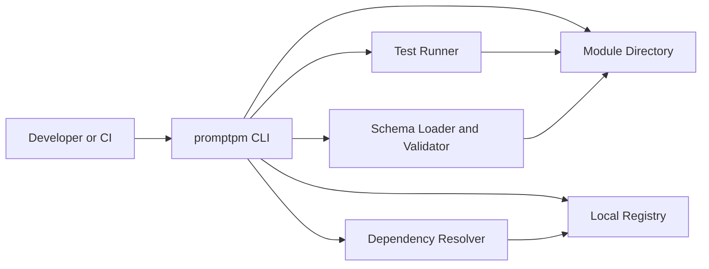
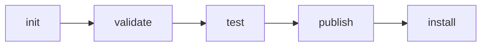

# PromptPM
A CLI-first package manager for prompt modules and agent logic, with deterministic validation, testing, dependency resolution, and publishing.

## High-Level Overview
PromptPM applies package-management discipline to prompt engineering.

- Prompt definitions are treated as software artifacts.
- Modules are versioned, testable, and composable.
- CLI behavior is deterministic and CI-friendly.
- Registry operations are local-first in the current implementation.

| Area | Current Behavior |
| --- | --- |
| Module lifecycle | `init`, `validate`, `test`, `publish`, `install` |
| Registry model | Local filesystem registry |
| Dependency model | SemVer ranges, deterministic resolution, cycle rejection |
| Quality gates | Schema validation + module tests before publish |
| Automation support | Stable output modes and exit-code contract |

> PromptPM behavior is defined by `docs/SPEC.md`, `docs/PROMPT_MODULE_SCHEMA.md`, and `docs/CLI_COMMAND_CONTRACT.md`.

## Problem Statement
Teams building prompt-driven systems run into recurring engineering problems:

- Prompt logic is often embedded directly in application code.
- Changes are hard to review as versioned, isolated artifacts.
- Dependency relationships between prompts are implicit.
- Compatibility issues surface late in integration or production.
- CI pipelines need stable, machine-readable command behavior.

PromptPM addresses these issues with explicit module contracts, deterministic command behavior, and local registry workflows.

## Core Concepts
### Prompt Module
A Prompt Module is the primary unit managed by PromptPM.

A module contains:

- `promptpm.yaml` (or `promptpm.toml`) with module metadata
- `template.prompt` prompt template file
- semantic interface definition
- optional dependencies
- optional tests

### Semantic Interface
A Semantic Interface defines what a module means and guarantees, not just text format.

Key elements:

- intent
- inputs
- outputs
- optional preconditions
- optional postconditions

### Registry
A Registry stores versioned modules. The current PromptPM implementation uses a local filesystem registry.

Registry behavior includes:

- deterministic module layout
- install and lookup by name/version
- immutability checks for published versions

### Unit Tests
Modules can declare tests that assert expected behavior.

Current test runner focus:

- deterministic execution
- clear per-assertion diagnostics
- publish-time gating (tests must pass before publish)

## Architecture Overview
PromptPM is organized as a CLI orchestration layer over deterministic core components.



| Layer | Responsibility |
| --- | --- |
| CLI (`promptpm/commands`) | Parse arguments, invoke core logic, emit structured output |
| Core (`promptpm/core`) | Validation, semver, resolution, registry, test execution |
| Schema (`schema_and_validator.py`) | Load and validate module schema/interface rules |
| Registry storage | Local, deterministic, immutable published versions |

## How PromptPM Works
1. Initialize a module scaffold in a working directory.
2. Define module metadata, template placeholders, and interface contract.
3. Run schema/interface validation.
4. Run module tests for deterministic quality checks.
5. Publish to the local registry only when validation and tests succeed.
6. Resolve and install dependencies by semantic version constraints.
7. Inspect installed modules with `list` and `info`.

## CLI Overview
| Command | Description |
| --- | --- |
| `promptpm init [--name <name>] [--version <version>]` | Initialize a new module skeleton in the current directory. |
| `promptpm validate [path]` | Validate module schema and semantic interface structure. |
| `promptpm test [path]` | Run declared module tests with structured diagnostics. |
| `promptpm install [path]` | Resolve dependencies and install from local registry. |
| `promptpm publish [path]` | Validate, test, and publish immutably to local registry. |
| `promptpm list` | List locally installed modules in deterministic order. |
| `promptpm info <module-name>` | Show module metadata and semantic interface details. |

### Global Flags
| Flag | Purpose |
| --- | --- |
| `--config <path>` | Provide config path for CLI context. |
| `--registry <path|url>` | Override registry path (current implementation enforces local filesystem path for registry operations). |
| `--quiet` | Suppress non-error output. |
| `--json` | Emit machine-readable JSON output. |
| `--pretty` | Emit human-readable structured output. |
| `--version` | Print CLI version. |

## Example Workflow
Typical lifecycle for a module:



```bash
# 1) Initialize
promptpm init --name technical-summarizer --version 0.1.0

# 2) Validate module contract
promptpm validate . --json

# 3) Run tests
promptpm test . --json

# 4) Publish to local registry
promptpm publish . --registry .promptpm_registry --json

# 5) Install dependencies for another module
promptpm install . --registry .promptpm_registry --json
```

## Determinism, Safety, and Guarantees
PromptPM is built around predictable behavior.

### Determinism
- Deterministic output modes (`default`, `--json`, `--pretty`).
- Deterministic dependency resolution order.
- Deterministic local registry layout.

### Safety
- Prompt content is treated as untrusted module data.
- PromptPM manages definitions and contracts; it does not execute prompts.
- Local registry immutability checks detect tampering of published versions.

### Guarantees
- Explicit, documented exit codes for automation.
- Structured error payloads with machine-readable error codes.
- Publish flow enforces validation and passing tests before install to registry.

## Non-Goals
PromptPM does not aim to provide:

- interactive prompt editing UI
- runtime model execution engines
- provider-specific optimization logic
- hidden telemetry or analytics
- undocumented command behavior

## CI/CD Integration
PromptPM is designed for non-interactive pipeline use.

Recommended gate sequence:

```bash
promptpm validate . --json
promptpm test . --json
promptpm install . --registry .promptpm_registry --json
```

Release stage:

```bash
promptpm publish . --registry .promptpm_registry --json
```

Exit-code contract (`docs/CLI_COMMAND_CONTRACT.md`):

- `0` success
- `1` validation error
- `2` test failure
- `3` dependency resolution error
- `4` publish conflict
- `5` internal error

## Project Status and Stability
- Current release line: **v0.1.x**.
- CLI command set is implemented and covered by tests.
- Local registry workflow is implemented and deterministic.
- Specifications and contracts are maintained in `docs/`.

> Stability is anchored to specification compliance and deterministic behavior, not rapid feature expansion.

## Contributing
See [`CONTRIBUTING.md`](CONTRIBUTING.md) for setup, coding standards, test requirements, and PR workflow.

## License
A `LICENSE` file is not currently present in this repository. Add one before redistribution or production adoption.
