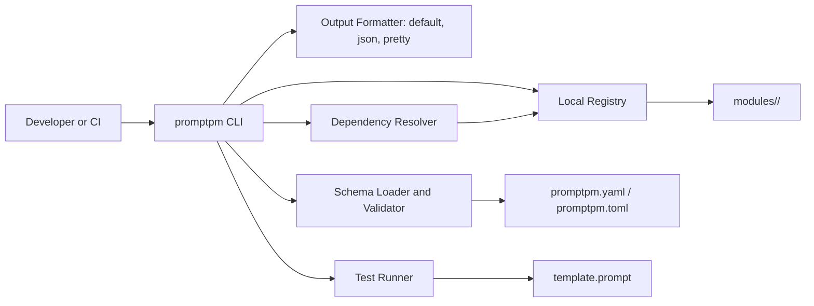
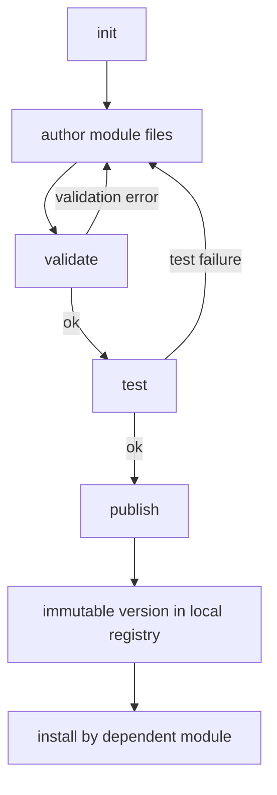

# PromptPM
PromptPM is a CLI-first package manager for prompt modules and agent logic, with deterministic validation, testing, dependency resolution, and local-first publishing.

## 1. Motivation and Problem Statement
Teams using prompts in production usually encounter the same failure patterns:

- Prompt text lives inside application code, so prompt changes are mixed with runtime logic changes.
- Prompt changes are hard to review as discrete, versioned artifacts.
- Dependencies between prompts are implicit and difficult to track.
- Contract mismatches are discovered late, often during integration.
- CI systems need stable, machine-readable command behavior and predictable exit codes.

PromptPM addresses this by making prompt modules explicit, versioned, validated, and testable through a deterministic CLI workflow.

## 2. What PromptPM Is and Is Not
| PromptPM Is | PromptPM Is Not |
| --- | --- |
| A package manager for prompt modules | A runtime that executes prompts against models |
| A schema and semantic contract validator | A UI prompt editor |
| A deterministic test runner for module assertions | A model/provider-specific optimization layer |
| A dependency resolver with semver range support | A telemetry or analytics platform |
| A local-first immutable registry workflow | A source of undocumented behavior |

> PromptPM behavior is defined by `docs/SPEC.md`, `docs/PROMPT_MODULE_SCHEMA.md`, and `docs/CLI_COMMAND_CONTRACT.md`.

## 3. Core Concepts
### Prompt Module
A Prompt Module is the unit of packaging and reuse.

A module consists of:

- metadata (`name`, `version`, `description`)
- prompt template file (`template.prompt`)
- semantic interface definition
- optional dependency declarations
- optional module tests

In practice, this makes prompt changes reviewable and versioned like other software artifacts.

### Semantic Interface
A Semantic Interface defines what a module is expected to do, not just how text is formatted.

It includes:

- `intent`
- `inputs`
- `outputs`
- optional `preconditions`
- optional `postconditions`

This enables static checks for contract completeness and safer module composition.

### Registry
A Registry stores versioned modules. The current implementation uses a local filesystem registry.

Registry characteristics:

- deterministic directory layout
- lookup by module name and version
- immutability enforcement for published versions

### Unit Tests
Module tests define expected behavior for prompt templates and assertions.

Current test model supports deterministic execution with structured diagnostics, and publish is gated on successful test results.

## 4. Architecture Overview
PromptPM separates command orchestration from deterministic core logic.

### High-Level System Architecture


### Prompt Module Lifecycle


### Component Responsibilities
| Component | Responsibility |
| --- | --- |
| `promptpm/commands` | CLI command entrypoints and orchestration |
| `promptpm/core/schema.py` + `schema_and_validator.py` | Module loading and schema/interface validation |
| `promptpm/core/test_runner.py` | Deterministic test execution and assertion diagnostics |
| `promptpm/core/semver.py` | Semantic version parsing, comparison, and range evaluation |
| `promptpm/core/resolver.py` | Deterministic transitive dependency resolution and cycle detection |
| `promptpm/core/registry.py` | Local registry install/lookup/list + immutability checks |
| `promptpm/utils/output.py` | Deterministic output formatting and emission |

## 5. How PromptPM Works Internally
For each CLI command, PromptPM follows a strict execution pattern:

1. Parse global and command-specific flags.
2. Resolve output mode (`default`, `json`, `pretty`) and quiet behavior.
3. Load module metadata and prompt/interface definitions from disk when needed.
4. Apply schema and semantic validation rules before dependent operations.
5. Execute command-specific core logic:
   - `test`: run assertions and collect structured failures.
   - `install`: resolve dependency graph using semver ranges.
   - `publish`: validate, test, enforce immutability, then install into local registry.
6. Emit deterministic output payloads.
7. Exit with documented command contract codes.

This design keeps behavior scriptable and suitable for automated gating.

## 6. CLI Overview
### Commands
| Command | Purpose |
| --- | --- |
| `promptpm init [--name <name>] [--version <version>]` | Initialize a module scaffold in the current directory. |
| `promptpm validate [path]` | Validate schema, semantic interface, and placeholder consistency. |
| `promptpm test [path]` | Run module tests and return structured diagnostics on failure. |
| `promptpm install [path]` | Resolve and install dependencies from the local registry. |
| `promptpm publish [path]` | Validate + test + publish immutably to local registry. |
| `promptpm list` | List installed modules in deterministic order. |
| `promptpm info <module-name>` | Show metadata and semantic interface for installed module versions. |

### Global Flags
| Flag | Behavior |
| --- | --- |
| `--config <path>` | Set config path in CLI context. |
| `--registry <path|url>` | Override registry location (registry operations currently require local filesystem paths). |
| `--quiet` | Suppress non-error output. |
| `--json` | Force JSON output. |
| `--pretty` | Force human-readable structured output. |
| `--version` | Print CLI version. |

### Exit Codes
| Code | Meaning |
| --- | --- |
| `0` | Success |
| `1` | Validation error |
| `2` | Test failure |
| `3` | Dependency resolution error |
| `4` | Publish conflict |
| `5` | Internal error |

## 7. Example End-to-End Workflow
The sequence below uses two modules: one producer module published to a local registry, then one dependent module that installs it.

```bash
# Create and publish a base module
mkdir summarizer
cd summarizer
promptpm init --name summarizer --version 0.1.0

# Edit promptpm.yaml, template.prompt, and tests as needed
promptpm validate . --json
promptpm test . --json
promptpm publish . --registry ../.promptpm_registry --json

# Create a dependent module
cd ..
mkdir review-pipeline
cd review-pipeline
promptpm init --name review-pipeline --version 0.1.0

# Add dependency in promptpm.yaml, for example:
# dependencies:
#   - name: summarizer
#     version: "^0.1.0"

promptpm install . --registry ../.promptpm_registry --json
```

## 8. Determinism, Safety, and Correctness Guarantees
### Determinism
- Dependency resolution order is deterministic.
- Output serialization is deterministic in JSON mode.
- Local registry layout is deterministic.

### Safety
- Prompt content is handled as untrusted module data.
- PromptPM does not execute prompts or model calls.
- Published versions are immutable and verified by manifest checks.

### Correctness
- Validation enforces required schema and interface structure.
- Placeholder declarations are checked against interface inputs.
- Publish requires validation and tests to pass.
- Errors include machine-readable codes with stable exit behavior.

## 9. Non-Goals and Explicit Exclusions
PromptPM does not provide:

- model runtime orchestration
- interactive authoring interfaces
- vendor-specific integrations
- remote network registry guarantees in current implementation
- hidden side effects outside defined command contracts

## 10. CI/CD Integration Guidance
PromptPM is designed for non-interactive pipeline execution.

### Recommended pipeline stages
```bash
promptpm validate . --json
promptpm test . --json
promptpm install . --registry .promptpm_registry --json
```

### Publish stage
```bash
promptpm publish . --registry .promptpm_registry --json
```

### Integration guidance
- Prefer `--json` for machine parsing.
- Gate merges/releases on non-zero exit codes.
- Keep registry path explicit in CI jobs for reproducibility.

## 11. Project Maturity and Stability Expectations
- Current release line is `v0.1.x`.
- Core CLI workflow and local registry behavior are implemented.
- Specification compliance and deterministic behavior are prioritized over rapid feature expansion.
- Behavior changes should be spec-driven and tested before adoption.

## 12. Contributing
Contribution guidelines are documented in [`CONTRIBUTING.md`](CONTRIBUTING.md).

Contributors should follow spec-first development and align changes with the documents in `docs/`.

## 13. License
A `LICENSE` file is not currently present in this repository. Add a license file before redistribution or production adoption.
